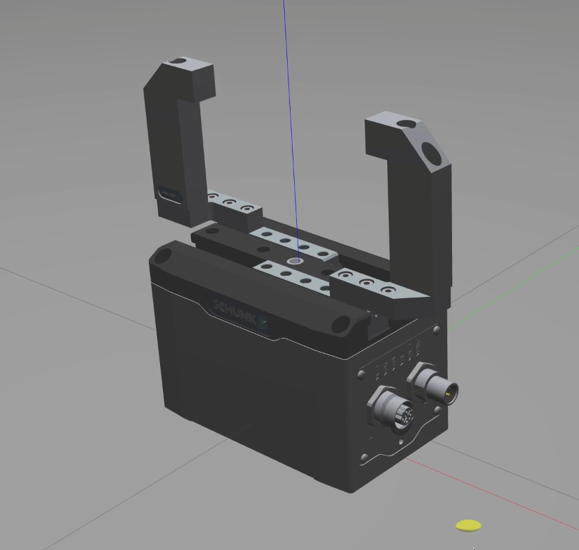
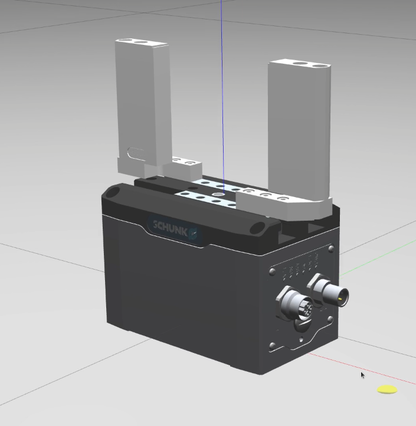
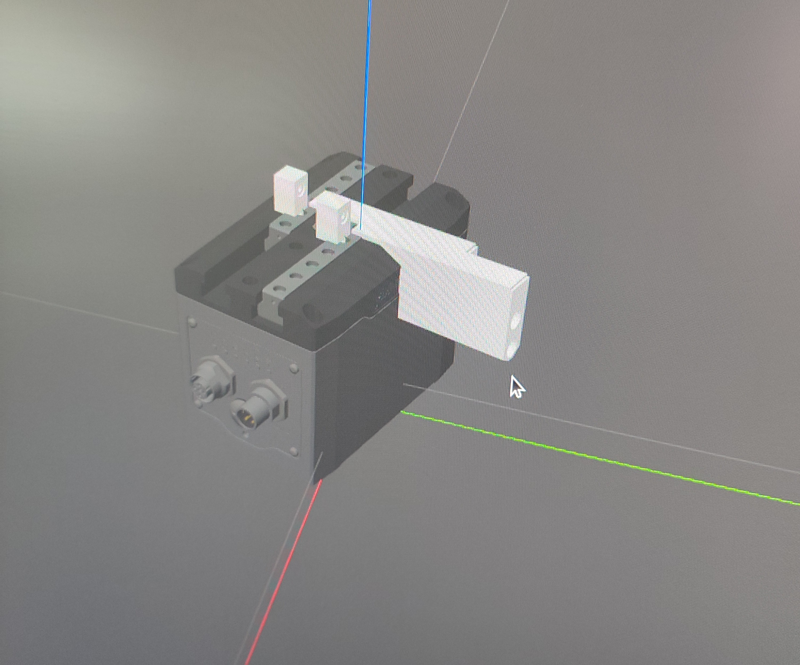

# egu_50_description Package


## Introduction

The `egu_50_description` package hosts the URDF (Unified Robot Description Format) models for the SCHUNK EGU 50 gripper. This document provides instructions on how to modify and utilize the provided models, especially concerning the replacement of finger models on the EGU 50 gripper.

## Package Structure

- **egu_50_description**: This package contains the URDF model files for the EGU 50 gripper.
  - **urdf**: Directory containing xacro files for different components.
    - `egu_50_base_link.xacro`: Base model of EGU 50 gripper without fingers.
    - `egu_50_fingers_link.xacro` and `egu_50_fingers_version2_link.xacro`: Different finger models for EGU 50 gripper.
  - **meshes**: Directory to place the mesh files for custom fingers.
       
## Customizing Fingers

To replace the fingers on the EGU 50 model, follow the steps below:

1. **Creating Finger Xacro Files**:
   - Create your own xacro files for the new fingers, referencing the structure and contents from `egu_50_fingers_link.xacro` or `egu_50_fingers_version2_link.xacro` as needed.

   
2. **Placing the Files**:
   - Place your created xacro file(s) in the `egu_50_description/urdf` directory.
   - Place corresponding mesh files in the `egu_50_description/meshes` directory.

3. **Naming Conventions**:
   - Ensure the base link names in your xacro files are `${prefix}base_link_left` and `${prefix}base_link_right`.

4. **Updating the Main Xacro File**:
   - Open `egu_50.xacro` file.
   - Replace the line:
     ```xml
     <xacro:include filename="$(find egu_description)/urdf/egu_50_fingers_version2_link.xacro"/>
     ```
     with your own finger xacro file name.
   - In the instantiation section, update the model name accordingly:
     ```xml
     <xacro:egu_50_fingers_version2_link prefix="${prefix_2}_" meshType="STL" />
     ```
     - If your mesh file is in `.dae` format, replace `STL` with `${meshType}`, for other formats, replace `STL` with the appropriate format (e.g., `stl`).

5. **Adjusting Finger Orientation and Position**:
   - If the assembled fingers do not align correctly, modify the `rpy` values in the following joint definitions in the `egu_50.xacro` file:
     ```xml
     <joint name="fixed_joint_gripper_base_link_right" type="fixed">
       <origin xyz="0.018 0 0.01" rpy="1.5708 0 -1.5708" />
       <parent link="${prefix_1}_translational_right" />
       <child link="${prefix_2}_base_link_right" />
       <axis xyz="0 0 0" />
     </joint>

     <joint name="fixed_joint_gripper_base_link_left" type="fixed">
       <origin xyz="-0.018 0 0.01" rpy="1.5708 0 1.5708" />
       <parent link="${prefix_1}_translational_left" />
       <child link="${prefix_2}_base_link_left" />
       <axis xyz="0 0 0" />
     </joint>
     ```


## Enabling Mimic Joint Functionality in Gazebo

The package utilizes the MimicJointPlugin for Gazebo to enable the mimic joint functionality. To activate this feature:

1. Clone the repository from [roboticsgroup_upatras_gazebo_plugins](https://github.com/roboticsgroup/roboticsgroup_upatras_gazebo_plugins.git) into your workspace.
2. Compile the plugin in your workspace to enable the mimic joint functionality in Gazebo.

## Verifying the Configuration

Finally, you can verify the finger linkage by launching the `display.launch` file located in the `launch` folder to open Gazebo and observe whether the fingers are linked correctly.


## Conclusion

With the above steps, you should be able to customize the finger models on the EGU 50 gripper and utilize the mimic joint functionality in Gazebo. For any issues or further inquiries, feel free to open an issue in this repository.
