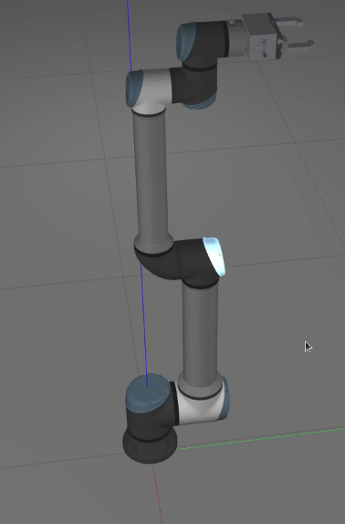

# egu_50_ur_description Package

## Introduction

The `egu_50_ur_description` package is designed to link the EGU 50 model with various UR (Universal Robots) robotic arm models. Before utilizing this package, ensure that the `universal_robot` package is installed and compiled on your system.



## Prerequisites


1. **Installation of universal_robot Package**:
   - If the `universal_robot` package is not installed, you can install it via apt package manager:
     ```bash
     sudo apt-get install ros-$ROS_DISTRO-universal-robots
     ```
   - Alternatively, you can clone the package from its repository into your workspace:
     ```bash
     git clone https://github.com/ros-industrial/universal_robot.git
     ```

## Configuration

If you wish to use a different UR robot model, you'll need to modify the `ur_egu.xacro` file located in the `urdf` directory of this package.

1. **Changing UR Robot Model**:
   - Open the `ur_egu.xacro` file.
   - Locate the following block of code:
     ```xml
     <xacro:macro name="ur10e_egu_robot" params="
       prefix=ur10e_
       joint_limits_parameters_file:='$(find ur_description)/config/ur10e/joint_limits.yaml'
       kinematics_parameters_file:='$(find ur_description)/config/ur10e/default_kinematics.yaml'
       physical_parameters_file:='$(find ur_description)/config/ur10e/physical_parameters.yaml'
       visual_parameters_file:='$(find ur_description)/config/ur10e/visual_parameters.yaml'
       transmission_hw_interface:=hardware_interface/EffortJointInterface
       safety_limits:=false
       safety_pos_margin:=0.15
       safety_k_position:=20">
     ```
   - Change the `prefix` parameter to match the UR model you wish to use, e.g., `prefix=ur16e_` for UR16e or `prefix=ur5e_` for UR5e.

## Usage

Once the prerequisites are met and the configuration is done, you can proceed to link the EGU 50 model with the UR robotic arm.

## Conclusion

The `egu_50_ur_description` package facilitates the integration of EGU 50 model with different UR robotic arm models. Ensure the `universal_robot` package is properly installed and configured as per the instructions above before proceeding.

For any issues or further inquiries, feel free to open an issue in this repository.
